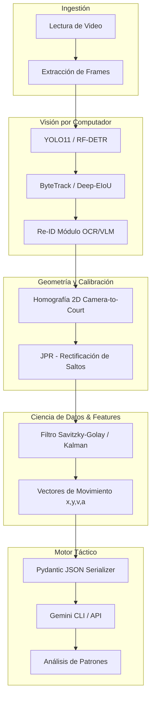

# Especificación Técnica: MVP Análisis Táctico de Baloncesto

## 1. Visión Arquitectónica

La clave para que este MVP no se convierta en un script inmanejable ("spaghetti code") es aplicar una **separación estricta de responsabilidades**. No podemos tener la lógica de inferencia de YOLO mezclada con la matemática de homografía o los prompts de Gemini.



## 2. Estructura de Directorios

La estructura generada sigue principios de diseño modular. Cada paquete tiene su propio dominio:

- `src/ingestion/`: Todo lo relacionado a entrada/salida de video (OpenCV `VideoCapture`, control de FPS).
- `src/tracking/`: Wrappers para Ultralytics (YOLO) y algoritmos de asociación (ByteTrack).
- `src/reid/`: Identificación de jugadores objetivo. Extracción de recortes y pasaje por modelos ligeros de OCR o VLM para extraer el número de camiseta.
- `src/calibration/`: Matemática pura. Matrices de homografía y corrección del error de paralaje introducido cuando los jugadores saltan (JPR).
- `src/features/`: Dominio de Data Science. Filtros de señal (Savitzky-Golay) sobre series temporales, cálculo de derivadas (velocidad, aceleración).
- `src/analytics/`: La capa de negocio. Donde los vectores se convierten en esquemas Pydantic y se envían a Gemini para razonamiento táctico.

## 3. Stack Tecnológico

| Capa | Herramientas / Librerías | Propósito |
| :--- | :--- | :--- |
| **Core** | `Python 3.10+` | Balance ideal entre performance y soporte de librerías ML recientes. |
| **Visión** | `Ultralytics (YOLO11)`<br>`OpenCV`<br>`PyTorch` | Detección SOTA (State of the Art) en tiempo real. OpenCV para manipulación matricial de imágenes. |
| **Tracking & Filtrado** | `ByteTrack`<br>`FilterPy` (Kalman) | ByteTrack maneja excelentemente oclusiones cortas. Kalman predice la cinemática. |
| **Calibración** | `SciPy`, `NumPy`, `Shapely` | Operaciones matriciales para homografía y geometría espacial de la cancha (Shapely). |
| **Datos & Validación** | `Pandas`, `Pydantic` | Pydantic es innegociable para garantizar que los JSONs que van/vienen de Gemini estén estructurados correctamente. |
| **Táctica** | `Gemini CLI / VLM` | Razonamiento de alto nivel sobre la matriz espacio-temporal. |

## 4. Diseño del Pipeline y Métodos

### 4.1. Calibración y Rectificación (El mayor desafío)
> [!WARNING]
> La homografía 2D asume que los puntos detectados (los pies del jugador) están siempre sobre el plano del suelo ($Z=0$). En el baloncesto, los saltos rompen esta presunción generando errores de proyección masivos.

**Solución JPR (Jump-Aware Position Rectification):**
1. Detectar el bounding box del jugador.
2. Intersectar el punto inferior del box (los pies) con la matriz de homografía $H$.
3. Aplicar una heurística de "suelo": Si la variación vertical en la imagen es abrupta sin traslación horizontal proporcional, asumir fase de vuelo. Corregir usando la posición $Z=0$ previa.

### 4.2. Extracción Espacio-Temporal
Los datos crudos de tracking tienen ruido inherente. No podemos mandarle posiciones puras a Gemini.
1. **Suavizado:** Aplicar un filtro `Savitzky-Golay` o un suavizado de Kalman (RTS) sobre toda la trayectoria de la posesión.
2. **Feature Engineering:** Calcular velocidad ($\Delta d / \Delta t$), aceleración y rumbo (ángulo de movimiento).
3. **Métricas Relativas:** Distancia entre el Jugador Objetivo A y el Jugador Objetivo B, y la distancia de ambos al balón.

### 4.3. Motor Táctico con Gemini
En lugar de procesar video crudo con Gemini (muy costoso y lento para análisis táctico fino de coordenadas), extraemos el "esqueleto táctico":

```python
# Ejemplo de esquema Pydantic para el motor táctico
class PlayerState(BaseModel):
    player_id: str
    x_court: float
    y_court: float
    speed_ms: float

class FrameData(BaseModel):
    timestamp_sec: float
    ball_pos: list[float]
    target_players: list[PlayerState]
```
Gemini consumirá esta serie temporal (en formato JSON compactado) junto con un prompt de rol para identificar patrones (Pick & Roll, cortinas, etc.).

---

## 5. Hoja de Ruta de Implementación (Roadmap)

### Fase 1: Fundaciones y Tracking (Semanas 1-2)
- [x] Estructuración del repositorio y setup de entorno.
- [ ] Implementar Ingestión: Extracción de frames y pruebas de I/O de video.
- [ ] Pipeline YOLO + ByteTrack: Lograr un tracking continuo del balón y de las personas (sin identificar quién es quién todavía).

### Fase 2: Geometría y Limpieza (Semanas 3-4)
- [ ] Módulo de Homografía: Mapeo de la cámara a las coordenadas 2D de una cancha FIBA/NBA.
- [ ] Implementación de JPR: Corregir distorsiones por saltos.
- [ ] Pipeline de Suavizado: Integrar `FilterPy` (Kalman) o `SciPy` (Savitzky-Golay) para trayectorias limpias.

### Fase 3: Re-ID e Interfaz de Datos (Semana 5)
- [ ] Identificación de los 2 jugadores objetivo (mediante crops + color histogram / OCR).
- [ ] Feature Extraction: Generar la matriz espacio-temporal consolidada.
- [ ] Serialización robusta con Pydantic.

### Fase 4: Inteligencia Táctica (Semana 6)
- [ ] Ingeniería de Prompts para Gemini: Enviar los esquemas JSON y evaluar la detección de jugadas.
- [ ] Visualización: Renderizado top-view (tipo radar 2D) con `Matplotlib` o `OpenCV` para validar visualmente lo que Gemini está leyendo.
